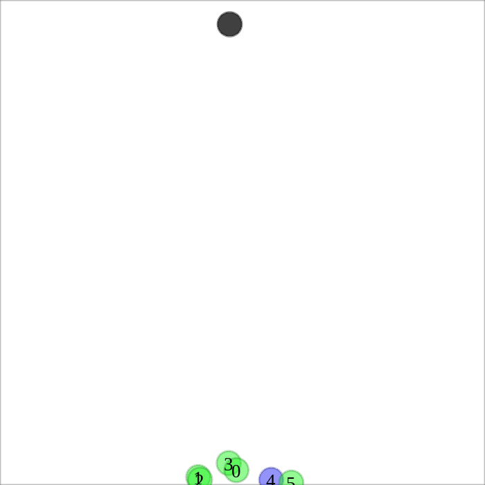
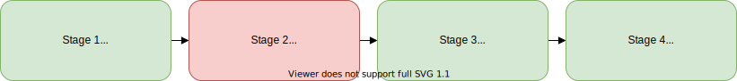

# Hiding Leader's Identity

This is the official repository for the following two papers:

1. **Hiding Leader's Identity in Leader-Follower Navigation through Multi-Agent Reinforcement Learning**<br/>
   Ankur Deka, Wenhao Luo, Huao Li, Michael Lewis, Katia Sycara<br/>
   *Accepted to IEEE/RSJ International Conference on Intelligent Robots and Systems ([IROS](https://www.iros2021.org/)) 2021*<br/>
   Paper Link: [Arxiv](https://arxiv.org/abs/2103.06359), [IROS](https://ieeexplore.ieee.org/abstract/document/9636314)
2. **Human vs. Deep Neural Network Performance at a Leader Identification Task**<br/>
   Ankur Deka, Michael Lewis, Huao Li, Phillip Walker, Katia Sycara*<br/>
   *Accepted to Human Factors and Ergonomics Society ([HFES](https://www.hfes.org/Events/International-Annual-Meeting)) Annual Meeting 2021*<br/>
   Paper Link: [PITT](https://sites.pitt.edu/~cmlewis/pubs/ankur-hfes.pdf), [HFES](https://journals.sagepub.com/doi/abs/10.1177/1071181321651127)

## Installation

I have tested this repository with  Python 3.6 on Ubuntu 18.04. First install [Anaconda](https://docs.anaconda.com/anaconda/install/linux/) and then run:

```
git clone git@github.com:Ankur-Deka/Hiding-Leader-Identity.git
cd Hiding-Leader-Identity
conda create python=3.6 pip --name HidingIdentity
conda activate HidingIdentity
pip install -r requirements.txt
```

Note: `gym_vecenv` MUST be installed from the link in `requirements.txt`. `pip install gym_vecenv` will NOT give the same results!

## Quick start - Pretrained policies
<p float="center">
    
    
    
    
    
    <figcaption>From left to right: Naive MARL, Our proposed strategy (Paper 1), Co-training (Stage 4 in Paper 2), Scripted PD, Zheng et al.</figcaption>
</p>

Download the folder `marlsave` from this [Drive link](https://drive.google.com/drive/folders/1JJpcSdAleKvkq9ZA8gubrIcXHU_ZpgyJ?usp=sharing) and store it in the root directory.

1. Naive MARL
```
python joint_main.py --mode test --load-mode individual --swarm-load-run 0 --swarm-load-ckpt latest --adversary-load-run 0 --adversary-load-ckpt latest --out-dir naive_marl --plot-trajectories --record --goal-at-top --seed 0
```
1. Our proposed leader identity hiding policy in Paper 1
```
python joint_main.py --mode test --load-mode joint --load-run 1 --load-ckpt latest --out-dir leader_hiding --plot-trajectories --record --goal-at-top --seed 0
```
1. Co-training - stage 4 in Paper 2
I am providing 3 training runs (2,3 and 4) due to stochasticity of results (refer to Paper 2).
```
python joint_main.py --mode test --load-mode joint --load-run 2 --load-ckpt latest --out-dir co_training --plot-trajectories --record --goal-at-top --seed 0
```
1. Scripted PD
```
python joint_main.py --mode test --algo scripted --load-mode individual --adversary-load-run 4 --adversary-load-ckpt latest --out-dir scripted_pd --plot-trajectories --record --goal-at-top --seed 0
```
1. Zheng et al.
```
python -W ignore joint_main_genetic.py --algo genetic --adversary-hidden-dim 512 --num-processes 1 --mode test --load-mode joint --load-run 5 --load-ckpt latest --adversary-version V2 --out-dir zheng --plot-trajectories --record --goal-at-top --seed 0
```

## Full details - Train and test yourself

<br/>

There are multiple stages of training as described in the above mentioned papers: Stage 1 to 3 in Paper 1, Stage 1 to 4 in Paper 2. For each stage, for both train and test mode, we need to `joint_main.py` or `adversary_training/main.py` with the right arguments as explained below.

### Stage 1
#### Train multi-robot team on goal reaching reward
```shell
python joint_main.py --mode train --use-adversary 0
```
Saves training files in a folder `marlsave/run_n1`. `n1` is generated automatically starting from 0 and increasing everytime we run train. Trained model checkpoints and tensorboard logs are saved here. It is important to note down the run number `n1` for use below.
#### Test
Replace `--load-run 0` with the same `n1` as above. `load-ckpt` can be `latest` or a valid number. Results are saved in `output/stage_1`
```shell
python joint_main.py --mode test --use-adversary 0 --load-mode joint --load-run 0 --load-ckpt latest --out-dir stage_1 --record --goal-at-top
```

### Stage 2
#### Train adversary to identify leader

1. Generate trajectory data <br/>
Replace `--load-run 0` with the right value of `n1` corresponding to training in stage 1.
```shell
python joint_main.py --mode test --use-adversary 0 --load-mode joint --load-run 0 --load-ckpt latest --out-dir stage_1_train --num-eval-episodes 1000
python joint_main.py --mode test --use-adversary 0 --load-mode joint --load-run 0 --load-ckpt latest --out-dir stage_1_test --num-eval-episodes 100 --goal-at-top
```
Saves trajectories in `output/stage_1_train/trajs` and `output/stage_1_test/trajs`.
1. Create a dataset folder <br/>
```shell
mkdir -p trajectory_datasets/dataset_1
mv output/stage_1_train/trajs trajectory_datasets/dataset_1/train_dataset
mv output/stage_1_test/trajs trajectory_datasets/dataset_1/test_dataset
```
1. Train adversary <br/>
```shell
cd adversary_training
python main.py --mode train --dataDir ../trajectory_datasets/dataset_1
```
This will save training files in `runs/run_n2` where `n2` is generated automatically. It is important to note down `n2` for use below.
1. Test adversary <br/>
Replace `0` in `--swarm-load-run 0` with `n1`. Replace `0` in `--adversary-load-run n2` with `n2`.
```shell
cd ..
python joint_main.py --mode test --load-mode individual --swarm-load-run 0 --swarm-load-ckpt latest --adversary-load-run 0 --adversary-load-ckpt latest --out-dir stage_2_results --plot-trajectories --record --goal-at-top
```

### Stage 3
#### Train swarm with goal reaching + identity hiding reward
Replace `0` in `--adversary-load-run 0` with `n2`. 
```shell
python joint_main.py --mode train --load-mode individual --adversary-load-run 0 --adversary-load-ckpt latest --train-adversary 0
```
Saves training files in a folder `marlsave/run_n2`.
#### Test
Replace `1` in `--load-run 0` with `n2`.
```shell
python joint_main.py --mode test --load-mode joint --load-run 1 --load-ckpt latest --out-dir stage_3_results --plot-trajectories --record --goal-at-top
```
This is our proposed policy in Paper 1.
### Stage 4
#### Joint training of swarm and adversary
```shell
python joint_main.py --mode train
```
#### Test
Replace `--load-run 1`
```shell
python joint_main.py --mode test --load-mode joint --load-run 1 --load-ckpt latest --out-dir stage_4_results --plot-trajectories --record --goal-at-top
```

## Baselines
### Scripted PD
set `algo=scripted`

```shell
python joint_main.py --mode test --use-adversary 0 --algo scripted --out-dir scripted_pd_train --num-eval-episodes 1000
python joint_main.py --mode test --use-adversary 0 --algo scripted --out-dir scripted_pd_test --num-eval-episodes 100 --goal-at-top
mkdir -p trajectory_datasets/dataset_scripted_pd
mv output/scripted_pd_train/trajs trajectory_datasets/dataset_scripted_pd/train_dataset
mv output/scripted_pd_test/trajs trajectory_datasets/dataset_scripted_pd/test_dataset

cd adversary_training
python main.py --mode train --dataDir ../trajectory_datasets/dataset_scripted_pd

cd ..
python joint_main.py --mode test --algo scripted --load-mode individual --adversary-load-run 4 --adversary-load-ckpt latest --out-dir scripted_pd_results --plot-trajectories --record --goal-at-top --seed 0
```

### Zheng et al. - Genetic

#### Pretraining Adversary
```
cd adversary_training
python main.py --mode train --dataDir ../trajectory_datasets/dataset_genetic_pretraining --lr 0.025 --version V2 --hiddenDim 512 --optimizer SGD
```
#### Co-optimization
```
cd ..
cmd python -W ignore joint_main_genetic.py --adversary-num-trajs 100 --algo genetic --adversary-load-ckpt latest --num-frames 1000000 --adversary-hidden-dim 512 --num-processes 1 --mode train --env-name simple_flocking --adversary-load-run 8 --load-mode individual --adversary-num-epochs 1 --adversary-version V2
```
Test
```
python -W ignore joint_main_genetic.py --algo genetic --adversary-hidden-dim 512 --num-processes 1 --mode test --env-name simple_flocking --load-mode joint --load-run 228 --load-ckpt latest --adversary-version V2 
```

## Utilities
### Generating plotting data
```
python gen_plot_data.py --load-run 32
```

### Recording and playing videos
Use `run_grid_search.py` file to generate multiple videos together. Open `swarm_training/output/video_previewing_tool/video_preview.html` on browser (tested on Firefox 75.0 beta and Chrome Version 83.0.4103.61 (Official Build) (64-bit)). Browse and select the videos you wish to play.

`--store-video-together` to store videos in common folder


### Analysing
1. For checking results of different ckpts of same run (1) pass an array of 'load-ckpt': [10,20,30,40,50,60,70,80,90,100], (2) 'store-video-together': [''], (3) DON'T pass 'out_dir' - auto generates out-dir names

#### Useful arguments
Arguments are defined in `arguments.py`
1. `num_frames`: No. of environment frames to train on 
1. `num_iters`: `num_frames // num_processes`
1. `update_every`: Updated after this many frames
1. `num_updates`: No. of updates for each `update_every`
1. `batch_size`  
1. `buffer_size`: Should be larger than max possible episode length     

#### Evaluation
1. `load-mode = {individual, joint}`
    1. `individual`: loads from `swarm-load-path` and `adversary-load-path`
    1. `joint`: loads from `load-path`

#### Automate
1. `joint_run.py` provides a convenient way to run multiple experiments. Earlier, I didn't have any problem but lately I'm having issues training in parallel. run_ID of one experiment is clashing with another

### User Data
1. `web_form` contains complete web based UI. In our experiments we hosted on a Apache web server running on a google cloud instance.
1. Data is saved in `user_data.txt`. `cd web_form && python conv2csv.py user_data.txt` to convert to csv format. If there is any space/new line at the end of `user_data.txt`, remove it before converting.

## Folders and files
1. `out_files`: trajectories of swarm robots, one episode per file
1. `adversary_training`: code for training adversary
    1. `Prototyping_notebook.ipynb`
    1. `runs`: checkpoints and tensorboard
    1. `main.py`: training/validating
    1. `dataset.py`: dataset class
    1. `models.py`: model classes
1. `swarm_training`: code for training swarm
    1. `main.py`: main file for running 
    1. `arguments.py`:  arguments
    1. `learner.py`: Learner - master object for the swarm
    1. `runs`: checkpoints and tensorboard 
1. `mape`: environment

## Environment Description
1. `simple_flocking` - goal reaching, leader observes goal location
1. `simple_trajectory` - trajectory following, leader observes next loc on trajectory (crude implementation). 'is_success' is always False
1. Successful if all agents are within a thershold distance to the goal
1. Reward: difference in distance + additional goal on task completion (disable right now)
1. Goal at the top half of the window during training and at y = 0.9 during testing (to get roughly uniform goal reaching time for human trials)
1. Adversary cannot see the goal
1. Implementation details:
    1. `done` is a list with `True`/`False` repeated num_agents times. All should have save value. Env is reset (by `gym_vecenv` or `PseudoVecEnv`) even if one of them is `True`
    1. `info['env_done']` contains done for overall team
    1. `info['is_success']` contains is_success for overall team 
    1. `env` reset when it's done by gym_vecenv or PseudoVecEnv, last obs stored in info['terminal_observation']
    1. `mape/multiagent/environment`: generates multiagent environment
    1. `mape/environment/scenarios/simple_flocking`: goal reaching environment


## Output files
1. stored in `output/args.out_file`
1. `adversary_preds` has csv files for different episodes. First column is true leader ID in corresponding video, second column is adversary's prediction.

## Common Issues
1. Pyglet:
```
File "./mape/multiagent/rendering.py", line 120, in render
    arr = np.fromstring(image_data.data, dtype=np.uint8, sep='')
AttributeError: 'ImageData' object has no attribute 'data'
```
Solution: `pip install pyglet==1.3.2`

## Acknowledgements
1. `swarm_training` directory is adapted from: [marl_transfer](https://github.com/sumitsk/marl_transfer).
2. Parts of the code for [Zheng et al.](https://arxiv.org/pdf/1909.10387.pdf) are adapted from the corresponding [private_flocking](https://github.com/proroklab/private_flocking) repository.

